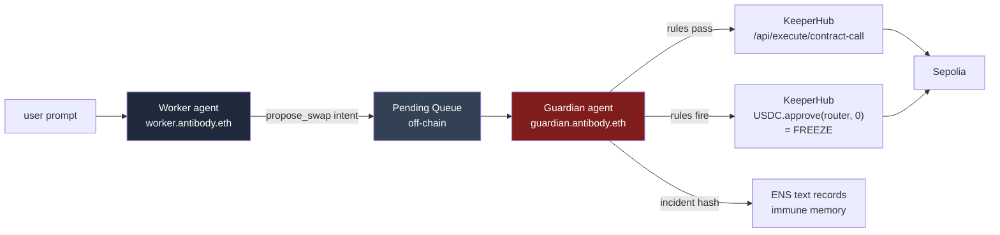

# Antibody

**An immune system for AI agents.** Autonomous safety infrastructure that detects on-chain misbehaviour and freezes the agent at machine speed — before a human even notices.

ETHGlobal Open Agents submission. Built on KeeperHub, ENS, and Uniswap.

---

## The problem

AI agents are being given real money and real authority on-chain. The infrastructure to *deploy* them is mature; the infrastructure to *contain them when they go wrong* does not exist. By the time a human notices a prompt-injected agent draining a treasury, the funds are gone. Multisigs don't help — they require humans to be awake.

Antibody is the missing layer.

## How it works

Three components, one strict architectural rule.



**The Worker** proposes intents (off-chain JSON only). It has no private key, no EOA, no execution authority. Its only output is `propose_swap` tool calls.

**The Guardian** holds the only KeeperHub `kh_` API key. For every proposal it runs three deterministic rule checks:
1. **Whitelist** — every address in the call must be a pre-approved counterparty.
2. **Strategy contradiction** — the call must match the policy's stated action (e.g. "buy WETH" cannot manifest as a raw `transfer`).
3. **Velocity anomaly** — burst rate above 4 intents per 5 minutes is anomalous.

If all three pass, the Guardian executes the swap via `POST /api/execute/contract-call`. If any fires, the Guardian executes `USDC.approve(router, 0)` via the same endpoint — a real on-chain revoke that stops the Worker dead. The incident hash is written to the Worker's ENS text record as immune memory.

**Why this architecture wins:** rule evaluation is deterministic; the LLM is the *explanation* layer, not the decision layer. So even if the Guardian is itself prompt-injected, the rules still gate. And because the Guardian is the only signer, the freeze is instant — there's no race to "catch" a malicious tx in flight, every action is gated by default.

## Sponsor integrations

| Sponsor | Where | Depth |
|---|---|---|
| **KeeperHub** | Sole on-chain executor. Both legitimate swap proposals AND the freeze go through `/api/execute/contract-call`. Worker has zero on-chain power. | Without KeeperHub, the project doesn't function. |
| **ENS** | `worker.antibody.eth` and `guardian.antibody.eth` carry the policy, reputation, alert history, and immune memory in text records. Guardian queries before approving and updates after every alert. | Real read+write usage; agent identity layer. |
| **Uniswap** | The Worker's day job is a USDC → WETH DCA strategy on the Uniswap V3 router. The injection scenario tries to redirect that flow. | Surface — the router is a whitelisted counterparty in policy. |

Verified live on Sepolia: [the freeze action firing on-chain](https://sepolia.etherscan.io/tx/0x536a0ba9e87490cc44f7a2ea70fd816b478c6eeefad9804cfab81bf3d1451e10).

## Demo

Two terminals plus a browser:

```bash
# terminal 1 — backend (Fastify + SSE)
pnpm exec tsx src/server/index.ts

# terminal 2 — frontend (Next.js)
cd frontend && pnpm dev
```

Open http://localhost:3000 — that's the landing page. Click **see it live →** (or go straight to http://localhost:3000/demo) for the live agent UI.

| What you do | What happens |
|---|---|
| Click **legit DCA** | Worker proposes `USDC.approve(router, 5_000_000)` → Guardian checks, all rules pass → KeeperHub executes → green "APPROVED & EXECUTED" card with a real Sepolia tx hash. |
| Click **Rule 1: attacker** | Worker proposes `USDC.transfer(0xDEADBEEF…, …)` → Guardian's whitelist + policy rules fire → red "ANOMALY DETECTED" card → KeeperHub fires `approve(router, 0)` → frozen banner appears with a real freeze tx hash. |
| Click **Rule 2: dump** | Worker proposes `USDC.transfer(treasury, 999_999_999_999)` → Guardian's policy rule fires (a transfer is not a buy) → freeze. |
| Click **Rule 3: burst** | Worker fires 5 approves in 2 minutes → first 4 execute → 5th trips the velocity rule → freeze. |
| Type into Worker chat: *"Run the scheduled DCA buy now."* | Real Claude (via TokenRouter) decides on the structured tool call → propose_swap → Guardian executes. |

After any rule fire, the chat input disables and the four scenario buttons are blocked — the Worker is frozen until you click **reset** in the header.

## Stack

- TypeScript everywhere. Node 22.
- **Backend:** Fastify + Server-Sent Events. `viem` for Sepolia primitives, `openai` SDK as the OpenAI-compatible client (TokenRouter is OpenAI-compatible).
- **Frontend:** Next.js 16 + Tailwind v4 + React 19. Static landing at `src/app/page.tsx`; live demo (split-screen Worker / Guardian, EventSource) at `src/app/demo/page.tsx`.
- **LLM:** TokenRouter routing to `claude-haiku-4-5` (Amazon Bedrock backend). MockLLM ships in the repo as a deterministic fallback for offline dev.
- **Execution:** KeeperHub `/api/execute/contract-call` on Ethereum Sepolia (chainId 11155111). KeeperHub manages the signing wallet via Turnkey.
- **Audit log:** append-only JSONL at `logs/audit.jsonl`. 0G Storage adapter is roadmap.

## Setup

1. Clone, `pnpm install` at the root and inside `frontend/`.
2. Copy `.env.example` → `.env` and fill:
   - `KEEPERHUB_API_KEY` — get a `kh_` key from app.keeperhub.com → Settings → API Keys → **Organisation** tab (the User tab gives `wfb_` keys which won't work).
   - `KEEPERHUB_NETWORK=sepolia`.
   - `TREASURY_ADDRESS` — the address KeeperHub gives you in Wallet Management. Fund it with Sepolia ETH (faucet) and Sepolia USDC (Circle faucet) for full demo cleanliness.
   - `TOKENROUTER_BASE_URL=https://open.palebluedot.ai/v1`, `TOKENROUTER_API_KEY=sk-…`, `TOKENROUTER_MODEL=claude-haiku-4-5`.
3. Run the two commands above.
4. Click around or paste prompts.

## What's in scope vs. roadmap

This repo ships:
- One Worker, one Guardian, three deterministic rules, four scenario buttons, an LLM-driven chat path, a frozen-state-persisting Guardian, real KeeperHub execution, real Sepolia txs, ENS-backed identity, and a single-page split-screen UI.

This repo deliberately does *not* ship (these are roadmap, not bugs):
- Multi-Guardian quorum / decentralised swarm.
- Learned anomaly detection (we use deterministic rules; the architecture critique was that an LLM-as-oracle re-introduces the injection vector you're trying to defend against).
- 0G Storage adapter (a `FileAuditLog` already implements the same interface — swap is one line).
- iNFT marketplace for agent reputation.

## Repo layout

```
src/
  audit/            append-only JSONL audit log + abstraction
  guardian/
    rules/          three deterministic rule evaluators + self-test
    explain.ts      LLM-generated reasoning trace (post-hoc, never decides)
    index.ts        rule pipeline + freeze + persistent frozen state
  keeperhub/        typed client wrapping /api/chains, /execute/*, /status
  llm/              provider-agnostic client; TokenRouter + Mock
  shared/           types, in-memory queue, policy fixture, ERC20 ABI
  worker/
    scenarios.ts    canned attack and legit fixtures
    proposer.ts     LLM-driven tool-use that emits SwapIntents
    index.ts        Worker process
  server/           Fastify + SSE runtime
  spike.ts          Day-1 KeeperHub smoke test (read + write)
  dev.ts            Multi-scenario CLI runner
frontend/           Next.js split-screen UI
```

## Live evidence

- **Freeze action mined:** [`0x536a0ba9…1451e10`](https://sepolia.etherscan.io/tx/0x536a0ba9e87490cc44f7a2ea70fd816b478c6eeefad9804cfab81bf3d1451e10) — Guardian fires `USDC.approve(router, 0)` via KeeperHub.
- **ENS subnames live:** [`worker.antibody.eth`](https://sepolia.app.ens.domains/worker.antibody.eth) and [`guardian.antibody.eth`](https://sepolia.app.ens.domains/guardian.antibody.eth) on Sepolia.
- **Policy is on-chain:** the Worker's `policy` text record holds the serialized whitelist + max-size + asset addresses. Server reads it at startup; the policy badge in the UI shows `via ENS`.
- **Immune memory is on-chain:** after firing `rule1-attacker` and triggering the freeze, the Worker's `incident` text record contains `{"intentId":…,"rules":["whitelist","policy"],"freezeTxHash":"0x7e5bebb7…3cf13"}` — verifiable from any ENS client without trusting our app.
- The repo's audit log (`logs/audit.jsonl`) records every Worker chat, intent, decision, Guardian explanation, and ENS write.

## Builder feedback

Honest feedback collected while building, with reproductions, suggestions, and what worked well:

- [`FEEDBACK-KEEPERHUB.md`](./FEEDBACK-KEEPERHUB.md) — eleven items grouped by UX friction, bugs, documentation gaps, and feature requests.
- [`FEEDBACK-UNISWAP.md`](./FEEDBACK-UNISWAP.md) — four real frictions encountered using V3 SwapRouter02 on Sepolia, plus the agent / autonomous-execution docs gap.

## License

MIT.
